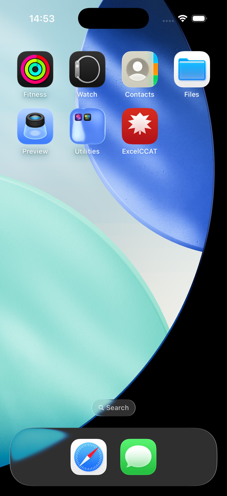

# ExcelCCAT - Frequently Asked Questions

> Your comprehensive guide to mastering the CCAT with ExcelCCAT

---

## Table of Contents

1. [Getting Started](#getting-started)
2. [Practice Tests](#practice-tests)
3. [Smart Learning](#smart-learning)
4. [Gamification & Achievements](#gamification--achievements)
5. [Progress Tracking](#progress-tracking)
6. [Settings & Customization](#settings--customization)
7. [Technical Support](#technical-support)

---

## Getting Started

### What is ExcelCCAT?

ExcelCCAT is a comprehensive CCAT (Criteria Cognitive Aptitude Test) preparation app designed specifically for Canadian students and professionals. It features:

- 🍁 Canadian-themed interface
- 📚 500+ practice questions
- 🧠 Smart learning algorithms
- 🏆 Gamification with achievements
- 📊 Detailed progress analytics

*The main dashboard showing your daily progress, streak, and quick actions*

### How do I start my first practice test?

1. Open the app and navigate to the **Dashboard**
2. Tap on **"Start Practice"** in Quick Actions
3. Select your preferred test mode:
   - **Quick Practice** (10 questions, 5 minutes)
   - **Standard Test** (25 questions, 12 minutes)
   - **Full Simulation** (50 questions, 15 minutes)
4. Choose question categories (or select all)
5. Tap **"Begin Test"**

*Configure your practice session with custom settings*

### What question types are included?

ExcelCCAT covers all three CCAT categories:

| Category | Description | Example Topics |
|----------|-------------|----------------|
| **Verbal** | Language & reasoning | Analogies, sentence completion, vocabulary |
| **Math & Logic** | Numerical reasoning | Word problems, sequences, calculations |
| **Spatial** | Visual reasoning | Pattern recognition, shape manipulation |

---

## Practice Tests

### How does the timer work?

- The timer counts down during your test session
- A progress bar shows remaining time
- When time runs out, unanswered questions are marked incorrect
- You can see elapsed time in your results

*Active test session showing question, timer, and answer options*

### Can I review my answers after a test?

Yes! After completing a test:

1. View your **Results Summary** with score breakdown
2. Tap **"Review Answers"** to see each question
3. Correct answers are shown in green ✓
4. Incorrect answers show the right answer
5. Detailed explanations are provided for each question

*Results summary showing your performance breakdown*

### What is Exam Mode?

Exam Mode simulates real CCAT conditions:

- ⏱️ Strict 15-minute timer
- 📝 50 questions (same as actual CCAT)
- 🔒 No hints or explanations during test
- 📊 Authentic scoring and percentile estimates

Enable Exam Mode in **Settings > Test Preferences**.

---

## Smart Learning

### How does Smart Learning work?

Our AI-powered Smart Learning system:

1. **Analyzes** your performance across all categories
2. **Identifies** your weak areas and knowledge gaps
3. **Prioritizes** questions you struggle with
4. **Adapts** difficulty based on your progress
5. **Schedules** reviews using spaced repetition

*Smart Learning recommendations based on your performance*

### What is Spaced Repetition?

Spaced repetition optimizes your learning by:

- Showing difficult questions more frequently
- Gradually increasing intervals for mastered content
- Ensuring long-term retention of concepts
- Reducing overall study time while improving results

### How do I enable Smart Learning?

1. Go to **Settings** (gear icon)
2. Toggle **"Smart Learning"** ON
3. The app will now personalize your experience

---

## Gamification & Achievements

### How does the XP system work?

Earn XP (Experience Points) through various activities:

| Activity | XP Earned |
|----------|-----------|
| Correct answer | +10 XP |
| Perfect score on test | +100 XP bonus |
| Daily login | +5 XP |
| Complete daily challenge | +50 XP |
| Streak bonus (per day) | +5 XP × streak days |

*Your achievements and XP progress*

### What are the levels?

Progress through 50 levels as you earn XP:

| Level Range | Title | XP Required |
|-------------|-------|-------------|
| 1-10 | Beginner | 0-1,000 |
| 11-20 | Intermediate | 1,000-5,000 |
| 21-30 | Advanced | 5,000-15,000 |
| 31-40 | Expert | 15,000-35,000 |
| 41-50 | Master | 35,000-100,000 |

### How do I unlock achievements?

Achievements are unlocked by reaching milestones:

**🏅 Common Achievements:**
- First Steps - Complete your first test
- Quick Learner - Answer 10 questions correctly
- Consistency - Maintain a 3-day streak

**🥈 Rare Achievements:**
- Perfect Score - Get 100% on any test
- Speed Demon - Complete a test in record time
- Week Warrior - 7-day streak

**🥇 Epic Achievements:**
- Century Club - Answer 100 questions correctly
- Category Master - Master all question types
- Month Marathon - 30-day streak

**💎 Legendary Achievements:**
- CCAT Champion - Reach Level 50
- Perfectionist - 10 perfect scores
- Ultimate Streak - 100-day streak

### What are Daily Challenges?

Each day features a new challenge:

- Complete before midnight to earn bonus XP
- Challenges vary in difficulty
- Examples: "Answer 5 verbal questions correctly", "Complete a test in under 10 minutes"
- Check the Dashboard for today's challenge

---

## Progress Tracking

### How do I view my progress?

Navigate to the **Progress** tab to see:

- 📈 Score trends over time
- 📊 Category breakdown (Verbal/Math/Spatial)
- ⏱️ Average time per question
- 🎯 Accuracy percentages
- 📅 Activity calendar

*Detailed analytics of your CCAT preparation progress*

### What do the statistics mean?

| Statistic | Description |
|-----------|-------------|
| **Overall Score** | Average percentage across all tests |
| **Questions Answered** | Total questions attempted |
| **Accuracy** | Percentage of correct answers |
| **Avg. Time/Question** | Your typical response time |
| **Current Streak** | Consecutive days of practice |
| **Best Streak** | Your longest streak ever |

### Can I export my progress data?

Currently, progress data is stored locally on your device. Cloud sync and export features are planned for future updates.

---

## Settings & Customization

### How do I change the app theme?

1. Go to **Settings** (gear icon)
2. Find **"Dark Mode"** toggle
3. Switch between Light and Dark themes

The app features a Canadian-themed design with:
- 🔴 Canadian red accent colors
- 🍁 Subtle maple leaf patterns
- 🌓 Full dark mode support

*Customize your ExcelCCAT experience*

### What settings are available?

| Setting | Description |
|---------|-------------|
| **Dark Mode** | Toggle light/dark theme |
| **Smart Learning** | Enable AI-powered recommendations |
| **Sound Effects** | Toggle audio feedback |
| **Haptic Feedback** | Enable vibration on iOS |
| **Notifications** | Daily practice reminders |
| **Timer Warnings** | Alert when time is running low |

### How do I reset my progress?

⚠️ **Warning: This action cannot be undone!**

1. Go to **Settings**
2. Scroll to **"Reset Progress"**
3. Confirm the reset
4. All statistics and achievements will be cleared

---

## Technical Support

### The app is running slowly. What can I do?

Try these steps:

1. **Close other apps** running in the background
2. **Restart the app** completely
3. **Restart your device**
4. **Check for updates** in the App Store
5. **Free up storage** space on your device

### I found a bug. How do I report it?

We appreciate bug reports! Please contact us:

- 📧 Email: support@excelccat.com
- 🐛 GitHub Issues: [github.com/rajkumar-natarajan/ExcelCCAT](https://github.com/rajkumar-natarajan/ExcelCCAT)

Include:
- Device model and iOS version
- Steps to reproduce the issue
- Screenshots if possible

### Is my data private?

Yes! ExcelCCAT respects your privacy:

- ✅ All data stored locally on your device
- ✅ No personal information collected
- ✅ No third-party analytics
- ✅ No ads or tracking

### Will there be an Android version?

Yes! An Android version is in development. Follow our GitHub repository for updates.

### How often is the app updated?

We release updates regularly with:

- New questions added monthly
- Bug fixes and performance improvements
- New features based on user feedback

---

## Still Have Questions?

If you couldn't find the answer you're looking for:

1. **Check our GitHub** for the latest information
2. **Email us** at support@excelccat.com
3. **Leave a review** on the App Store with your feedback

---

## Quick Tips for CCAT Success

### 🎯 General Tips

1. **Practice daily** - Even 10 minutes helps
2. **Focus on weak areas** - Use Smart Learning
3. **Time yourself** - Speed is crucial on the CCAT
4. **Don't overthink** - Trust your first instinct
5. **Stay calm** - Anxiety hurts performance

### 📚 By Category

**Verbal:**
- Read the entire question carefully
- Look for context clues
- Eliminate obviously wrong answers

**Math & Logic:**
- Estimate before calculating
- Look for patterns in sequences
- Double-check your arithmetic

**Spatial:**
- Rotate shapes mentally
- Count sides and angles
- Look for symmetry

### ⏱️ Time Management

- Spend ~18 seconds per question
- Don't get stuck - move on and return
- Answer every question (no penalty for guessing)
- Save 1-2 minutes for review

---

*Good luck on your CCAT! 🍁*

**ExcelCCAT v1.5.0** | Made with ❤️ in Canada
